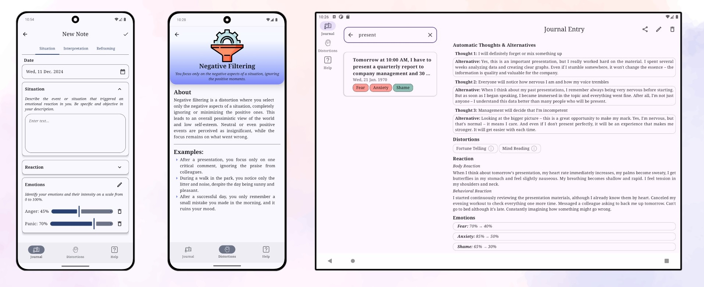

[Русская версия](README_ru.md)
# CBTJournal

*CBTJournal* is an Android application designed to work with negative thoughts and emotions using Cognitive Behavioral Therapy (CBT) techniques.

## About CBT and ABCD Model

CBT helps track the connection between situations, thoughts, emotions, and reactions, and then correct maladaptive thinking patterns. The ABCD model (Activating event-Beliefs-Consequences-Dispute) allows you to analyze situations, identify cognitive distortions in your beliefs, find more rational alternatives, and reduce the intensity of negative emotions.

## Key Features
CBTJournal helps users apply CBT techniques in their daily life:
- Step-by-step creation of notes using the ABCD model
- Structured storage and management of notes
- Library of cognitive distortions with descriptions and examples
- Reference materials on how to use the application
- Note export functionality
- Support for English and Russian languages

## Screenshots

## Tech Stack

- **UI**: Jetpack Compose
- **Architecture**: Multi-module project, Clean Architecture + MVVM
- **Dependency Injection**: Hilt
- **Database**: Room
- **Asynchronous Operations**: Kotlin Coroutines + Flow
- **Navigation**: Jetpack Navigation Compose
- **UI/UX**: Material Design 3, adaptive layouts

## Current Status
The application is currently in the testing phase of basic functionality. Contact the developer: telegram/**@AIN_Sln** or email [ain.sln.ai21@gmail.com](mailto:ain.sln.ai21@gmail.com)
