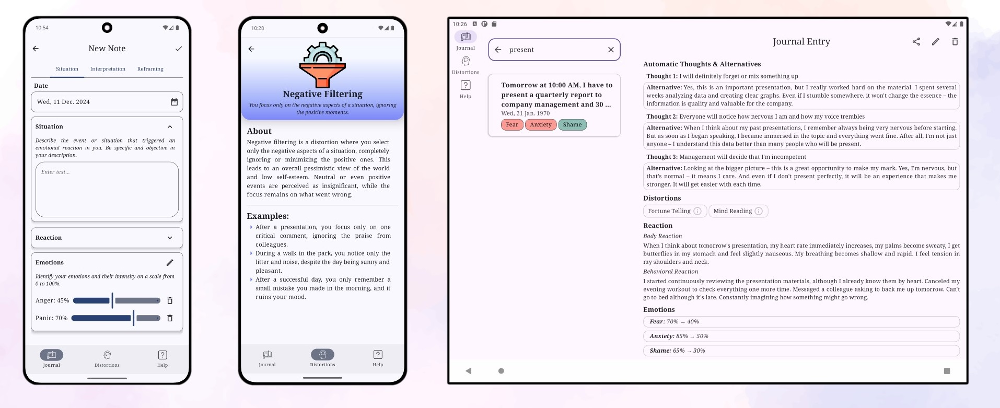

[English version](README.md)
# CBTJournal

*CBTJournal* - это Android-приложение для работы с негативными мыслями и эмоциями с помощью техник когнитивно-поведенческой терапии (КПТ).

## О КПТ и технике СМЭР

КПТ помогает отслеживать связь между ситуациями, мыслями, эмоциями и реакциями, а затем корректировать неадаптивные паттерны мышления. Техника СМЭР (Ситуация-Мысль-Эмоция-Реакция) позволяет проанализировать происходящее, выявить когнитивные искажения в своих мыслях и найти более рациональные альтернативы, что помогает снизить интенсивность негативных эмоций.

## Основные возможности приложения
CBTJournal помогает пользователям применять техники КПТ в повседневной жизни:
-   Создание записей с пошаговым заполнением всех компонентов СМЭР
-   Структурированное хранение и управление записями
-   Библиотека когнитивных искажений с описаниями и примерами
-   Справочные материалы по работе с приложением
-   Возможность экспорта записей
-   Поддержка русского и английского языков

## Скриншоты

## Стек технологий

-   **UI**: Jetpack Compose
-   **Архитектура**: Многомодульный проект, Clean Architecture + MVVM
-   **Dependency Injection**: Hilt
-   **База данных**: Room
-   **Асинхронные операции**: Kotlin Coroutines + Flow
-   **Навигация**: Jetpack Navigation Compose
-   **UI/UX**: Material Design 3, адаптивные макеты

## Текущий статус
На данный момент приложение проходит этап тестирования базового функционала.  Связаться с разработчиком: telegram/**@AIN_Sln** или по адресу [ain.sln.ai21@gmail.com](mailto:ain.sln.ai21@gmail.com)
